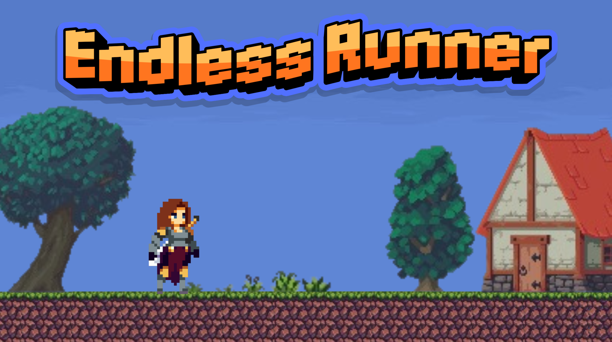
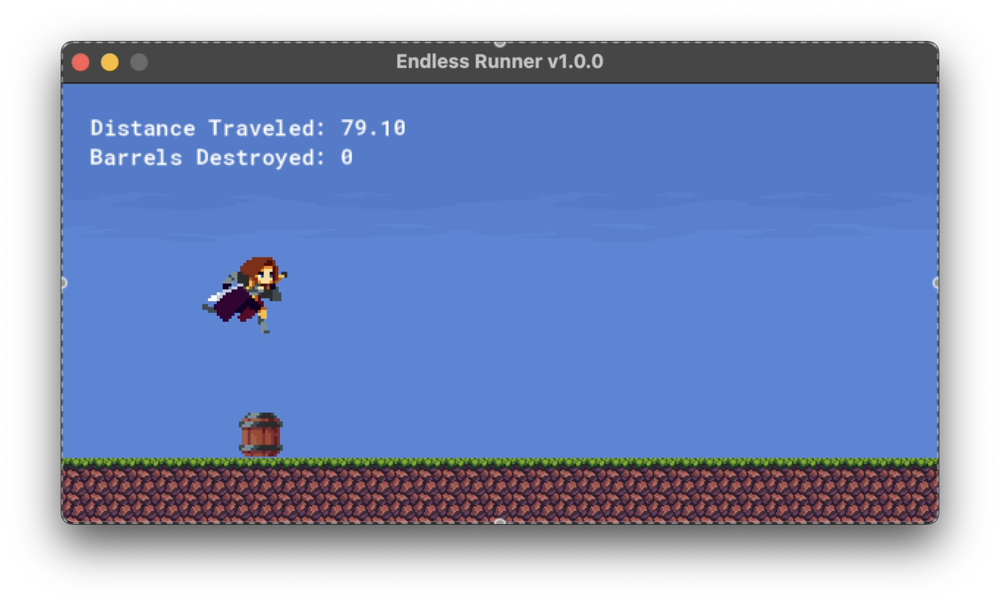
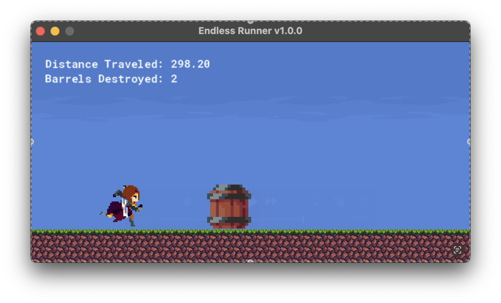
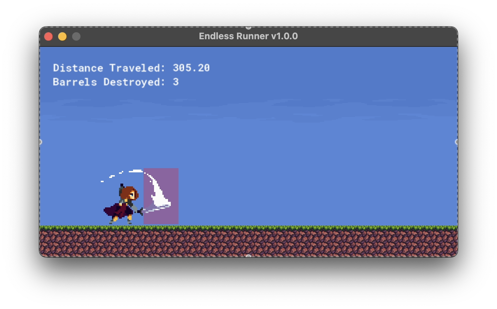
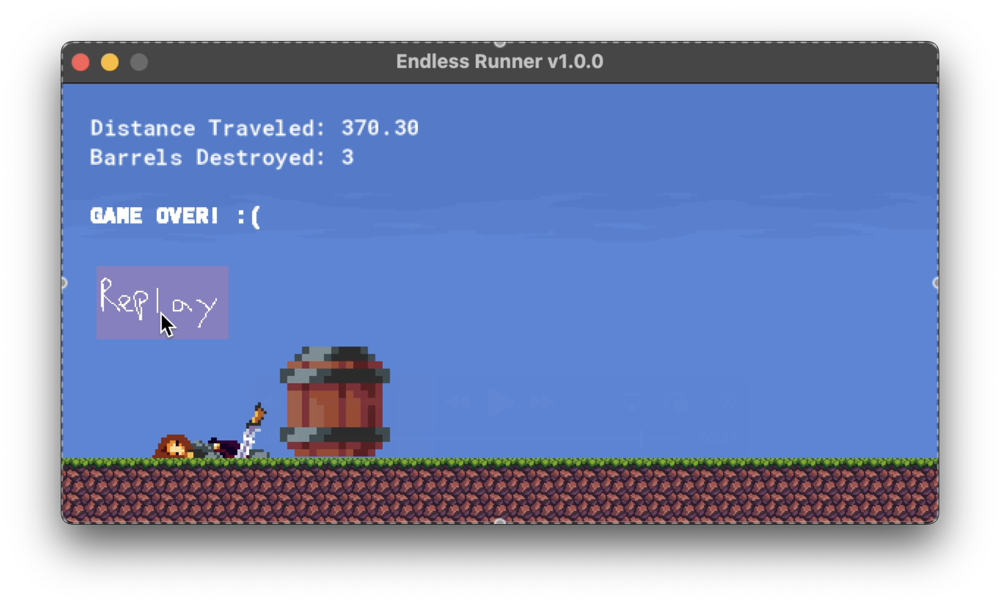

<!-- UPDATED Jan. 12, 2025 -->
<p align="center"></p>

# 🛤️ Endless Runner <i>(2D)</i>
Run endlessly and see if you can beat your previous high score. ⋆˙⟡ ⋆🛢️.˚ ⊹₊⟡ 💨⋆

This game currently has: **obstacles** and an **attacking mechanic**.<br>
Made in GameMaker `v2024.14.2.213`! :]

<!--Project version, tech stack-->
<p align="center">
<a href="https://github.com/Jenspi/EndlessRunner/releases">

<br>
<!--<a href="https://github.com/Jenspi/Sorts/tree/main/Sorts-Builds/MAC"></a>
<a href="https://github.com/Jenspi/Sorts/tree/main/Sorts-Builds/WINDOWS"></a>-->
<a href="https://jenspi.itch.io/endless-runner"></a><br>
</p>


## 📋 Table of Contents
<a id="readme-toc"></a>
- [🛤️ Endless Runner (2D)](#️-endless-runner-2d)
  - [📋 Table of Contents](#-table-of-contents)
  - [❣️ Features](#️-features)
  - [🕹️ Controls](#️-controls)
  - [🛢️ Demo (Play for Yourself!)](#️-demo-play-for-yourself)
  - [📦 Screenshots](#-screenshots)
  - [🛣️ Roadmap](#️-roadmap)
  - [🔧 Technical Details](#-technical-details)
    - [🔖 Requirements](#-requirements)
    - [🚀 Local development setup \& usage](#-local-development-setup--usage)
    - [🏗️ File Architecture](#️-file-architecture)
  - [📄 License](#-license)
    - [👤 Author](#-author)
  - [🙇 Acknowledgements](#-acknowledgements)


## ❣️ Features

**🆓 FREE to Play**<br>
No ads or micro-transactions<br>
Perfect for fans of Flappy Bird or Google's Dinosaur Game<br>

**🛏️ Low Effort Gameplay (enjoy while it lasts)**<br>
Run at the same speed indefinitely, and dodge enlarging barrels!<br>
See how much distance you can travel in one run
<p align="right"><i><a href="#readme-toc">(back to table of contents)</i></a></p>


## 🕹️ Controls

This is an endless runner where, instead of running faster over time, barrels get bigger and you jump higher.

How far can you get?<br>

`SPACE` → Jump<br>
`Mouse Left-click` → Swing sword<br>
<p align="right"><i><a href="#readme-toc">(back to table of contents)</i></a></p>


## 🛢️ Demo (Play for Yourself!)

**PLAY Endless Runner for free on itch.io!**<br>

<a href="https://jenspi.itch.io/endless-runner"></a><br>

Please leave it a <b>rating and/or comment</b> while you're there! It would mean the world to me! 🌎❣️
<p align="right"><i><a href="#readme-toc">(back to table of contents)</i></a></p>


## 📦 Screenshots
<p align="center" height=100% width=100%><p align="center"><i>Jumping (v1.0.0)</i></p></p>
<p align="center" height=100% width=100%><p align="center"><i>Barrel incoming! (v1.0.0)</i></p></p>
<p align="center" height=100% width=100%><p align="center"><i>Attacking barrel to destroy it (v1.0.0)</i></p></p>
<p align="center" height=100% width=100%><p align="center"><i>Death (v1.0.0)</i></p></p>
<p align="right"><i><a href="#readme-toc">(back to table of contents)</i></a></p>


## 🛣️ Roadmap

**Mechanics**
* [ ] Lower the points earned via distance, probably n/10.0
* [ ] Make hero run faster over time
* [ ] Weapon cooldown
* [ ] Add obstacles to slide under
  * [ ] Slide mechanic

**Features**
* [ ] Add leaderboard
  * [ ] bad word filter
* [ ] Achievements (popups for itch.io & saves for local copies)
* [ ] Add music

**Scenes**
* [ ] Start screen, pause menu, and polished UI

**Aesthetics & Accessibility**
* [ ] Different sprites (new idea is pizza delivery :> )
* [ ] Icons in place of text to support all ages and languages
* [ ] Mobile-friendly (controls, dimensions, etc)
* [ ] Better-fitting dimensions for itch.io & PC

<!-- Implemented features -->
<!--
* [x] 
-->

<!-- RECENT-ly implemented features -->
<!--<b><i>(recently added!)</i></b> <i>(Jan. 12, 2026)</i><br>
* [x] 
-->

<!-- NEW-ly implemented features -->
<b><i>(newly added!)</i></b> <i>(Jan. 12, 2026)</i><br>
* [x] Replay button
<p align="right"><i><a href="#readme-toc">(back to table of contents)</i></a></p>


## 🔧 Technical Details
### 🔖 Requirements

<b><u>Playing Endless Runner</u></b>
* [Play free on itch.io](#demo-play-for-yourself)
<!--<br><i>or</i><br>
* [Download GameMaker MacOS .app in Project Directory](https://github.com/Jenspi/Sorts/tree/main/Builds/MAC)
* [Download GameMaker Windows .exe in Project Directory](https://github.com/Jenspi/Sorts/tree/main/Builds/WINDOWS)-->

<b><u>Opening Endless Runner in the Game Engine</u></b>
* [Sytem requirements & setup for GameMaker*](https://gamemaker.zendesk.com/hc/en-us/articles/360002406417-Technical-Setup-Info)
* [GameMaker Install (whatever version after `v2024.14.2.213`)](https://gamemaker.io/en/download)


### 🚀 Local development setup & usage

Simply open the project (.yyp file) with version `2024.14.2.213` or higher.
<p align="right"><i><a href="#readme-toc">(back to table of contents)</i></a></p>


### 🏗️ File Architecture

A few files and directory references you might(?) find useful.
```
Sorts/
├── Assets/
│   ├── Scenes/                     # Game levels
│   │   ├── Level1.unity            # Stationery sorting level
│   │   ├── Level2.unity            # Fruits & vegetables level
│   │   └── Level3.unity            # Chess pieces level
│   ├── Scripts/                    # C# game logic
│   │   ├── DragAndDrop.cs          # Item dragging mechanics
│   │   ├── GameManager.cs          # Level completion detection; Pause/Quit menu logic
│   │   ├── Grabber.cs              # Apply to game objects you want to be grabbable
│   │   └── ItemSlot.cs             # Apply to game objects you want to be item slots
│   ├── Models/                     # 3D models and prefabs
│   │   ├── Stationery/             # Office supplies assets for level 1
│   │   ├── BellPeppersCapsicums/   # Bell peppers for level 2
│   │   ├── LowPolyFarmLite/        # Vegetables, props for level 2
│   │   └── Chess/                  # Chess pieces for level 3
├── README_images/                  # Sorts icon, gifs, and gameplay screenshots
├── Research                        # Research documents
│   └── Research.md                 # Project Proposal, Post-Mortem, and User Feedback
├── Builds/                         # Sorts executables for MacOS, Windows, and WebGL
```

```bash
EndlessRunner/
├── objects/                        # Game objects & logic
├── sprites/                        # Visual assets
│   ├── spr_player_*/               # Player animations
│   │   ├── spr_player_idle/
│   │   ├── spr_player_running/
│   │   ├── spr_player_jumping/
│   │   ├── spr_player_attack/
│   │   └── spr_player_death/
│   └── spr_barrel/                 # Obstacle object sprite
├── tilesets/                       # Level building blocks
│   └── ts_ground/                  # Ground tileset
├── roadmap.md                      
├── README.md                       
└── EndlessRunner.yyp               # GameMaker project file
```
<p align="right"><i><a href="#readme-toc">(back to table of contents)</i></a></p>


## 📄 License

[![CC BY-NC-ND 4.0][cc-by-nc-nd-shield]][cc-by-nc-nd] <br>
*Updated January 12, 2026.*

This work is licensed under a
[Creative Commons Attribution-NonCommercial-NoDerivs 4.0 International License][cc-by-nc-nd].


### 👤 Author

<p align="center"><p align="center"><i>Jenny Spicer / Jennifer Spicer</i></p></p>

<p align="center">
<a href="https://jenspi.github.io/"></a>
<a href="https://www.linkedin.com/in/jenspi/"></a>
<a href="https://www.github.com/jenspi/"></a>
</p>
<p align="right"><i><a href="#readme-toc">(back to table of contents)</i></a></p>


## 🙇 Acknowledgements

* [**Clembod**– Warrior-Free Animation set V1.3](https://clembod.itch.io/warrior-free-animation-set?download)
* [**Clembod**– Country Village](https://clembod.itch.io/country-village-free-pack)


<!-- Variables -->
[cc-by-nc-nd]: http://creativecommons.org/licenses/by-nc-nd/4.0/
[cc-by-nc-nd-image]: https://licensebuttons.net/l/by-nc-nd/4.0/88x31.png
[cc-by-nc-nd-shield]: https://img.shields.io/badge/License-CC%20BY--NC--ND%204.0-lightgrey.svg?style=for-the-badge&